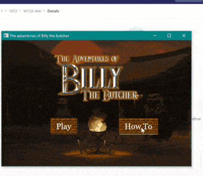

# Dungeon Game

## Overview
* JUint testing with basic unit testing to ensure the backend works correctly

* Java application that makes use of class libraries

* Created a graphical user interface programming

* Used design patterns and agile project managemenet

* JUint testing with basic unit testing to ensure the backend worked correctly

## Setting Up

* Uses JavaFX (Java 11 Zulu JDK FX) and Eclipse

## Files
* User Stories.pdf: user stories to facilitate the software development process
* design.pdf: illustrates the design patterns used and the structure of the entire project as a UML diagram
* /dungeons: lays out each level with different dungeons
* /images: images used for the game entities
* /src/unsw/dungeon/: contains the java files
* /src/unsw/dungeon/test: contains JUnit testing for each basic game play

## Collaborators
* Sarah Oakman
* Lavanya Sood
